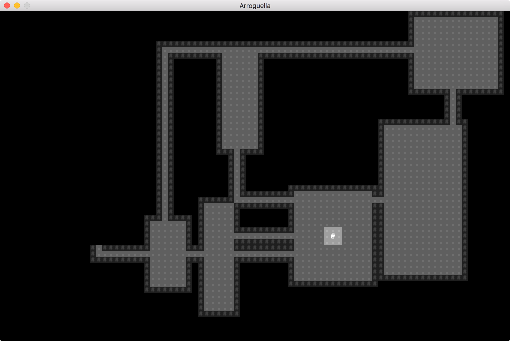

# arroguella

A procedurally-generated Roguelike written in Python3



## Set up

```bash
./scripts/setup.sh
```

## Running the game
```bash
# From within the virtual environment created by setup.sh
python main.py

# When ready to exit the virtual environment:
exit
```

### Play instructions
You, the character, are represented by the `@` symbol.

| Key | Action |
| --- | ------ |
| Arrow keys | Moves the character in that direction |

Each level of the dungeon begins unexplored.
